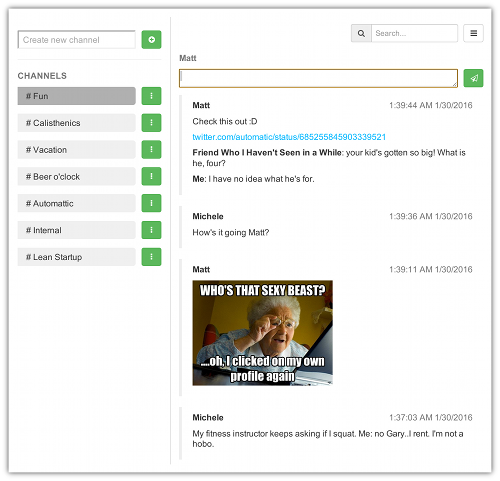

# blah
Real-time communication app supporting Markdown syntax based on Node.js, Express, Jade, Mongoose, Passport, socket.io. Think Slack on (whatever is the opposit of) steroids.

It also features all kinds of security vulnerabilities you can think of. From XSSs to CSRFs in all their wonderful varieties. Use at your own risk.

